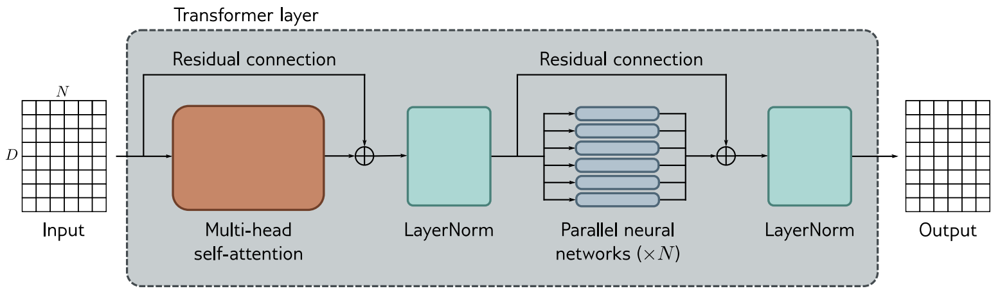

# Bidirectional Encoder Representations from Transformers (BERT)
This section aims to reproduce the "BERT: Pre-training of Deep Bidirectional
Transformers for Language Understanding" (2019) [1].
Original codebase is here: https://github.com/google-research/bert, and in this section we will
code up from scratch, a smaller implementation of BERT.

- [Bidirectional Encoder Representations from Transformers (BERT)](#bidirectional-encoder-representations-from-transformers-bert)
  - [Introduction](#introduction)
    - [Relevant Reading](#relevant-reading)
  - [Method](#method)
    - [Model Architecture](#model-architecture)
  - [References](#references)

## Introduction
Bidirectional Encoder Representations from Transformers (BERT) is a model designed to pre-train
on a large corpus of text using the masked language modelling (MLM) technique.
MLM is a technique where a sentence (or multiple sentences) is fed into the model, with a percentage
of the words "masked" out, and the model must predict what the missing word is.
The model is "bidirectional" because it has both the left and right context when trying to predict any
missing word.
The purpose of this pretraining task is to enable the model to understand the general semantics of
the language it is being trained on.
The pretrained model can then be fine-tuned for more specific language tasks (such as sentiment
classification).

### Relevant Reading
 - Ch 12 of Understanding Deep Learning by Simon Prince covers the Transformer architecture [2].
 - Ch 12.4. specifically, covers the Transformer encoder layer, as first introduced in Vaswani,
  A. (2017) [3], which is the underlying architecture of BERT.

## Method
### Model Architecture
BERT's model architecture is a "multilayer bidirectional Transformer".
What this essentially means is that is is composed of multiple Transformer encoder layers,
as originally described in Vaswani, A. (2017) [3]. and explained in Prince S.J.D., (2023) [2] Ch 14.
It is bidirectional becuase the model has both left and right context, every single token in the input
pays attention to every other token in the input (even if the token comes after it in the sentence).


*Source: Figure 12.7 from [Understanding Deep Learning by Prince S.J.D., (2023)](https://udlbook.github.io/udlbook/)*

The above figure details a single Transformer encoder layer.
A batch $N$ input tokens, each of dimensionality $D$ are fed into a
[`MultiHeadSelfAttentionBlock`](../../dlc/transformers/modules.py) with a residual
connection (this simply means that the input is added onto the output of the self attention block).
A `nn.LayerNorm` is performed, then fed into a feed forward network with a single hidden layer
```python
nn.Sequential(
  nn.Linear(D, D*4),
  nn.ReLU(),
  nn.Linear(D*4, D),
)
```
with another residual connection.
This is again fed into a `nn.LayerNorm` before producing the output.
This layer is implemented in [`TransformerEncoderLayer`](../../dlc/transformers/modules.py).

You can find a generic [`Bert`](./models.py) model and the
[`BertBase`](./models.py) model by following the links into [./models.py](./models.py).
[`BertBase`](./models.py) is the architecture of the smaller 110M parameter model
trained in the Bert paper [1].


## References
[1] Devlin, J., Chang, M., Lee, K., Toutanova, K. (2019). BERT: Pre-training of Deep Bidirectional
Transformers for Language Understanding. [arXiv:1810.04805](https://arxiv.org/abs/1810.04805).

[2] Prince, S.J.D. (2023). Understanding Deep Learning. The MIT Press. Available at: http://udlbook.com.

[3] Vaswani, A., Shazeer, N., Parmar, N., et al. (2017). Attention Is All You Need.
[arXiv:1706.03762](https://arxiv.org/abs/1706.03762).
